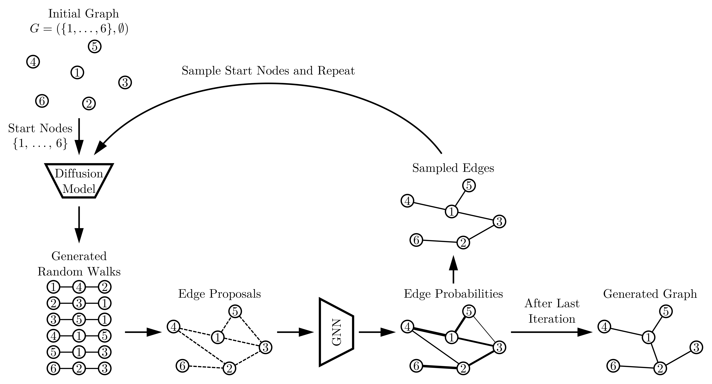

# Random Walk Diffusion for Efficient Large-Scale Graph Generation

Official implementation of the ARROW-Diff graph generation method proposed in the paper
"Random Walk Diffusion for Efficient Large-Scale Graph Generation".
ARROW-Diff is a novel approach for large-scale graph generation based on random walk diffusion.
It generates graphs by integrating two components into an iterative procedure: (1) An order agnostic autoregressive
diffusion model on the level of random walks that learns the generative process of random walks of an input graph,
and (2) a GNN component that learns to filter out unlikely edges from the generated graph. Due to the random
walk-based diffusion, ARROW-Diff efficiently scales to large graphs, significantly reducing the generation time.

Overview of ARROW-Diff.

## Getting Started

Run `conda install -r requirements.txt` to install the required packages.

## Usage

The code comprises two main components:
1) Training of the diffusion model and the GNN
2) Graph generation (sampling)

### ARROW-Diff Training

Please change the name of the dataset and other parameters in `configs/config.yaml`
and run the training script using the command `python main_arrow_diff_training.py`.

### ARROW-Diff Graph Generation

Please set the `graph_generation` parameters in `configs/config.yaml`
and run the graph generation script using the command `python main_arrow_diff_graph_generation.py`.
